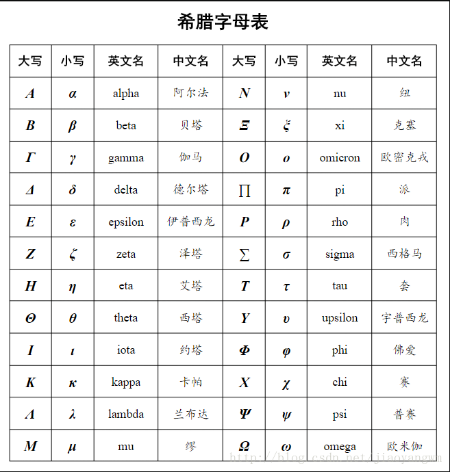

# 符号

> 支持两种方式: \$...$ or \&...;

## 普通符号

&pm;
&times;
&div;
&mid;
&cdot;
&circ;
&ast;
&bigodot;
&bigotimes;
&leq;
&geq;
&neq;
&approx;
&equiv;
&sum;
&prod;
&coprod;

## 数学符号（$\log$）
$a^b$

1. 上下标

- $a^b$ 上标 ^
- $a_b$ 下标 _

2. 分数

\frac{ }{ }

第一个{ }写分子，第二个{ }写分母。

分数 3+8a5b+63+8a5b+6 $\frac{3+8a}{5b+6}$

3. 累加

\sum_{ }^{ }

累加号的上标下标的前后顺序可以互换。

名称 数学表达式 markdown公式

求和号 ∑3xn∑3xn $\sum{3x^n}$

带范围求和 ∑Nn=13xn∑n=1N3xn $\sum_{n=1}^N{3x^n}$

4. 累乘

\prod_{ }^{ }

累加号的上标下标的前后顺序可以互换。

名称 数学表达式 markdown公式

求和号 ∏3xn∏3xn $\prod{3x^n}$

带范围求乘 ∏Nn=13xn∏n=1N3xn $\prod_{n=1}^N{3x^n}$

5. 开方

\sqrt[ ]{ }

[ ]中写的是开几次方，{ }中写的是需要开方的数值。

名称 数学表达式 markdown公式

开方号 100−−−√51005 $\sqrt[5]{100}$

6. 积分

\int_{ }^{ }

名称 数学表达式 markdown公式

积分 ∫51f(x)dx∫15f(x)dx $\int^5_1{f(x)}{\rm d}x$

二重积分 ∬51f(x)dx∬15f(x)dx $\iint^5_1{f(x)}{\rm d}x$

三重积分 ∭51f(x)dx∭15f(x)dx $\iiint^5_1{f(x)}{\rm d}x$

正无穷、负无穷

\infty

名称 数学表达式 markdown公式

正无穷 +∞+∞ $+\infty$

负无穷 −∞−∞ $-\infty$

极限

名称 数学表达式 markdown公式

左箭头 limn→+∞nlimn→+∞n $\lim_{n\rightarrow+\infty} n$

关系运算符

名称 数学表达式 markdown公式

大于等于 ≥≥ $\geq$

小于等于 ≤≤ $\leq$

包含于 ⊂⊂ $\subset$

包含 ⊃⊃ $\supset$

属于 ∈∈ $\in$

二元运算符

名称 数学表达式 markdown公式

加减 ±± $\pm$

点乘 ⋅⋅ $\cdot$

乘 ×× $\times$

除 ÷÷ $\div$

否定关系运算符

不等于 ≠≠ $\not=$

- 不小于 ≮≮ $\not<$

不包含 ⊅⊅ $\not\supset$

10. 对数运算符

对数 loglog $\log$

对数 log218log2⁡18 $\log_2{18}$

对数 lnln $\ln$

三角运算符

名称 数学表达式 markdown公式

垂直 ⊥⊥ $\bot$

角 ∠∠ $\angle $

30度角 30∘30∘ $30^\circ$

正弦 sinsin $\sin$

余弦 coscos $\cos$

正切 tantan $\tan$

左箭头 ←← $\leftarrow$

右箭头 →→ $\rightarrow$

长箭头 ⟶⟶ $\longrightarrow$

上箭头 ↑↑ $\uparrow$

下箭头 ↓↓ $\downarrow$

# 集合运算

emptyset; emptyset

in;

notin; notin

subset; subset

supset; supset

subseteq; subseteq

supseteq; supseteq

bigcap; bigcap

bigcup; bigcup

bigvee; bigvee

bigwedge; bigwedge

biguplus; biguplus

bigsqcup; bigsqcup

三角运算

\bot \angle 30^\circ \sin \cos \tan \cot \sec \csc

微积分运算

y{\prime}x \int \iint \iiint \oint \lim \infty \nabla

逻辑运算

\because \therefore \forall \exists

箭头

\uparrow \downarrow \leftarrow \rightarrow \Uparrow \Downarrow \Leftarrow \Rightarrow \longleftarrow \longrightarrow \Longleftarrow \Longrightarrow

连线

\overline{a+b+c+d}

\underline{a+b+c+d}

\overbrace{a+\underbrace{b+c}_{1.0}+d}^{2.0}

\hat{y} \check{y} \breve{y}

# 

        ¼ 四分之一符号 \&frac14;
        
        ” 双引号 \&quot;
        
        × 乘号 \&times;
        
        ← 向左箭头 \&larr;
        
        & AND符号 \&amp;
        
        ÷ 除号 \&divide;
        
        ↑ 向上箭头 \&uarr;
        
        <  小于符号 \&lt;
        
        ± 正负符号 \&plusmn;
        
        → 向右箭头 \&rarr;
        
        \>  大于符号 \&gt;
        
        ↓ 向下箭头 \&darr;
        
          空格 \&nbsp;
        
        √ 根号 \&radic;
        
        ↑ 双向箭头 \&harr;
        
        ?  倒问号 \&iquest;
        
        ∞ 无限大符号 \&infin;
        
        ⇐ 双线向左箭头 \&lArr;
        
        ?  双左箭头 \&laquo;
        
        ∠ 角度符号 \&ang;
        
        ⇑ 双线向上箭头 \&uArr;
        
        ?  双右箭头 \&raquo;
        
        ∫ 微积分符号 \&int;
        
        ⇒ 双线向右箭头 \&rArr;
        
        ‘ 左单引号 \&lsquo;
        
        ° 度数符号 \&deg;
        
        ⇓ 双线向下箭头 \&dArr;
        
        ’ 右单引号 \&rsquo;
        
        ≠ 不等于符号 \&ne;
        
        ⇔ 双线双向箭头 \&hArr;
        
        “ 左双引号 \&ldquo;
        
        ≡ 相等符号 \&equiv;
        
        ♠ 黑桃符号 \&spades;
        
        ” 右双引号 \&rdquo;
        
        ≤ 小于等于符号 \&le;
        
        ♣ 梅花符号 \&clubs;
        
        ¶ 段落符号 \&para;
        
        ≥ 大于等于符号 \&ge;
        
        ♥ 红心符号 \&hearts;
        
        § 章节符号 \&sect;
        
        ⊥ 垂直符号 \&perp;
        
        ♦ 方块符号 \&diams;
        
        © 版权所有符号 \&copy;
        
         ½ 二分之一符号 \&frac12;
        
        ∴ 所以符号 \&there4;
        
        …  \&hellip; 
        
        ® 注册商标符号 \&reg;
        
        1 批注1符号 \&sup1; 
        
        2 批注2符号,平方 \&sup2; 
        
        ™ 商标符号 \&trade;
        
        γ Gamma符号 \&gamma;
        
        € 欧元符号 \&euro;
        
        ￠ 美分符号 \&cent;
        
        ‰ 千分符号 \&permil;
        
        ￡ 英镑符号 \&pound;
        
        ￥ 日圆符号 \&yen; 

        ⊕ \&oplus;

# 字母

- ƒ \&fnof;
- 大写: 首字母大写即可

