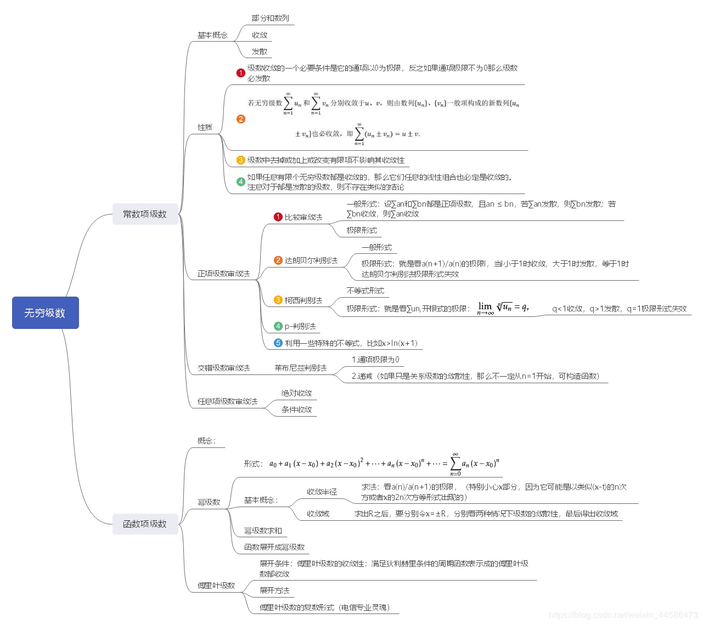

# 重积分

1. 二重积分的概念

2. 二重积分的计算

3. 三重积分

   - 概念和性质

    区域可加，被积函数可加

    对称？？？

   - 直角坐标系

 先一后二，先二后一

   - 柱面坐标系
    (&rho;,&theta;,z)
   先Z,r
   与圆相关,x^2+y^2
   f*r

   - 球面坐标系

  (r,&theta;,zom)
  r>=0,0-2&pi;,0-&pi;
  x=rsin&phi;cos&theta;
  y=rsin&phi;sin&theta;
  z=rcos&phi;
  &rho;=rsin&phi;
  z=rcos&phi;

> 边界小于等于2点，大分割

4. 重积分的应用

    - 体积
    - 面积
    - 质心
    - 转动惯量
    - 引力

# 曲线积分和曲面积分

1. 对弧长的曲线积分-第一类曲线积分

    - 定义
    - 计算
    - 可代性

2. 对坐标的曲线积分-第二类曲线积分

    - 概念
    - 计算

> 两类曲线积分的关系

3. 格林公式

> 连通区域(单,复)
> 
> 方向

## 级数

1. 常数项

2. 常数项级数的审判法

    - 正
    - 交错
    - 任意
    -

3. 幂级数

    - 函数展开的条件
    - Abel
    - 运算

4. 泰勒级数

    - 常见

5. 傅里叶级数/三角级数

    - f(x)=a0/2+
    - 三角函数系

      > 正交
      > (-π,π) 不同相乘积分为0,同为π(1除外)
      >

    - 求a0 积分

      > an 乘cosnx 积分
      > bn sinnx
      > 傅里叶系数

    - 展开的充分条件 狄利克雷充分条件

      > 收敛性

    - 正弦,余弦级数

      > 奇
      > 偶

    - 非周期函数 延拓

      > 到2π
      > f(x+2π)=f(x)
      > 奇延拓 偶延拓
      >

    - 

